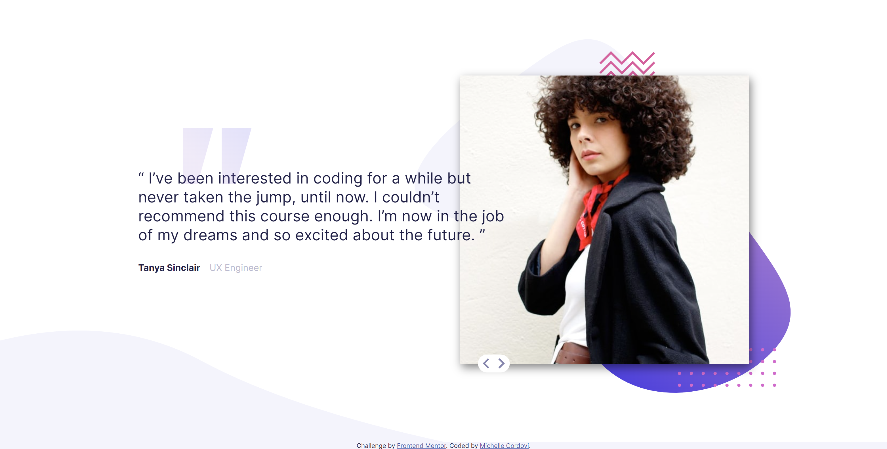

# Frontend Mentor - Coding bootcamp testimonials slider solution

This is a solution to the [Coding bootcamp testimonials slider challenge on Frontend Mentor](https://www.frontendmentor.io/challenges/coding-bootcamp-testimonials-slider-4FNyLA8JL). Frontend Mentor challenges help you improve your coding skills by building realistic projects. 

## Table of contents

- [Overview](#overview)
  - [The challenge](#the-challenge)
  - [Screenshot](#screenshot)
  - [Links](#links)
- [My process](#my-process)
  - [Built with](#built-with)
  - [What I learned](#what-i-learned)
  - [Continued development](#continued-development)
- [Author](#author)

**Note: Delete this note and update the table of contents based on what sections you keep.**

## Overview

### The challenge

Users should be able to:

- View the optimal layout for the component depending on their device's screen size
- Navigate the slider using either their mouse/trackpad or keyboard

### Screenshot

 
 


### Links

- Solution URL: [https://github.com/michellecordovi/BootcampTestimonial/tree/main](https://your-solution-url.com)
- Live Site URL: [https://michellecordovi.github.io/BootcampTestimonial/](https://your-live-site-url.com)

## My process

### Built with

- HTML
- CSS custom properties
- CSS Grid
- Vanilla Javascript


### What I learned

This project was a fun exercise to hone in on my CSS formatting skills, particularly with the management of different images and positioning. This was also a great project for me to practice my newly learned Javascript events. I struggled a little bit getting the arrows to work to change the images, until finally realizing that the arrow variable I created with the ".arrow" classes was an array, requiring a for loop for my function to work. A great learning experience and a lesson I won't forget.


```js
let tanyaTestimonial = document.querySelector(".tanya-block");
let johnTestimonial = document.querySelector(".john-block");

let arrow = document.getElementsByClassName("arrow");


function changeTestimonial() {
      if (johnTestimonial.style.display === "none") {
            tanyaTestimonial.style.display = "none";
            johnTestimonial.style.display = "grid";
      } else {
            tanyaTestimonial.style.display = "grid";
            johnTestimonial.style.display = "none";
      };
}

for (let i = 0; i < arrow.length; i++) {
      arrow[i].onclick = changeTestimonial;
}
```

### Continued development

I look forward to taking on more challenging projects to continue to improve my Javascript and CSS skills. In the future I'd like to take courses on CSS transitions and animations as I think they would be a nice addition to this project.


## Author

- Website - [Michelle Cordovi GitHub](https://github.com/michellecordovi)
- Frontend Mentor - [@michellecordovi](https://www.frontendmentor.io/profile/michellecordovi)
